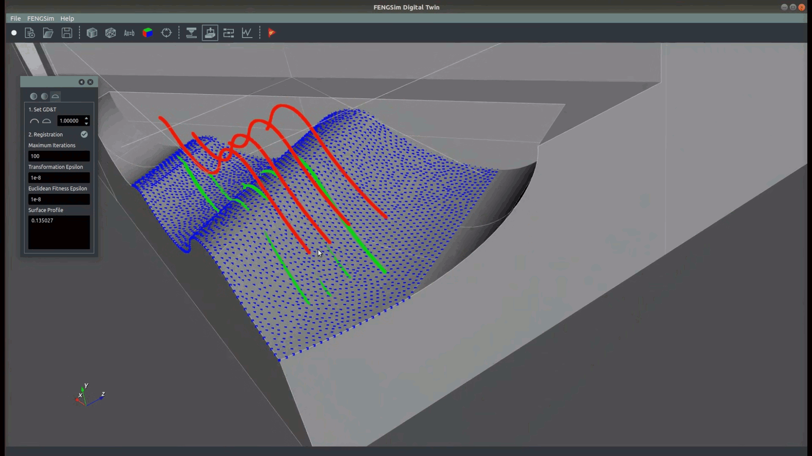

## Welcome to the FENGSim project !

  

### About the FENGSim project

The FENGSim project is an open source project for the digital twin including CAD, CAE, CAM and CAI. Normally it is difficult and impossible to develop a digital twin system like Siemens TeamCenter, Dassault 3D Experience, Ansys WorkBench without many people and a lot of money, but we prove that we could do it by using open source software, and it is easy and good enough for the industry. If you want to have your own digital twin software, you could use FENGSim and find how to develop it in the details  and all the codes in our github project. 

**About Digital Twin**

For our understanding, there are three important things about the digital twin. 

- The manufactures could not finish all the testings to confirm the full capability of the products especially for the complex engineering like aircrafts. There should be an optimization through the whole product life. 
- The manufactures always like to concentrate on their manufacturing and they don't want to do MRO by themselves. The users or the third party will do MRO, but they will follow the instructions from the manufactures. 
- After the manufacturing, the real product will be different with the design. 

 

  

### Our ARM cluster
 

  

