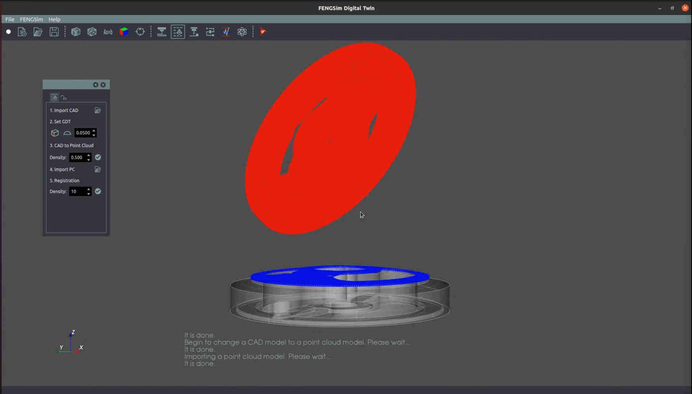
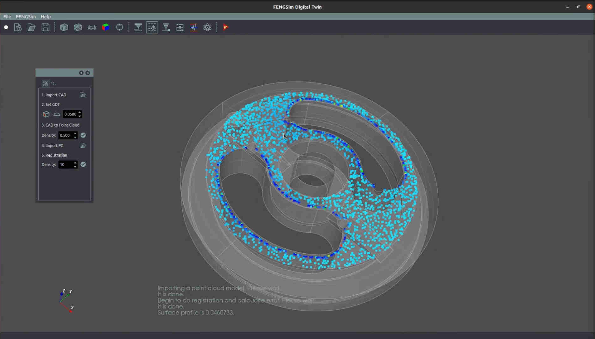

## About the FENGSim project

The FENGSim project is an open-source project for Digital Twins. Without a large team and a lot of money, it is normally difficult and near impossible to develop a digital twin system like Siemens TeamCenter, Dassault 3D Experience and Ansys WorkBench etc. But we’ve proven that open-source software is a good solution to this and it brings its products directly to industrial sector. If you want to develop your own digital twin software, join the FENGSim project!

**About Digital Twin**

These are the things you should know about why we need Digital Twins:

- Given the cost and time in industrial production, it would be infeasible for manufacturers to complete the comprehensive and extreme assessment of their products, especially for complex systems like an aircraft. Therefore, the product should be optimized throughout the whole life cycle. 
- The manufacturers mainly concentrate on their designing and manufacturing processes and usually do not do MRO (maintenance, repair, and operations) by themselves. The users or the third party will do MRO following the instructions from the manufacturers. Since the manufacturers do not track the use of their products, they will normally just provide conservative instructions. So, MRO can be a big cost for users and it will generally affect the performance of the products.
- Manufacturing is a very complicated process. Mismatching between products and their designs, whether in a small or large scale, will severely undermine their future performance. We thus have to optimize the manufacturing processes, in the meantime taking into account the effect of manufacturing techniques on the evaluation of product performance. 

From the above, there are many roles and stages in the product life cycle, so we need a unified model  to coordinate all the work and this is the reason for Digital Twin.  

The followings are the core technologies used in Digital Twins:

- CAD, CAE, CAM and CAI,
- the coupling of system simulation and physical field simulation,
- manufacturing simulation,
- the coupling of CAX and artificial intelligence,
- geometrical and physical sensors,
- immersive interaction,
- edge computing.

## [Airfoil Benchmark](https://github.com/fengsim/FENGSim-Dev/wiki/Home)

Here we show you how to develop your own digital twin project by introducing the Airfoil benchmark, a digital twin example developed at FENGSim.   

#### ARM Super Computer

## Applications

#### Additive Manufacturing

#### Measurement

#### Propellant

#### Composite Materials

#### Test and Evaluation

#### Diagnosis, Prognosis, and Health Monitoring

#### Monitoring, Reporting and Verification

#### Biomedical Engineering	

#### Virtual City

